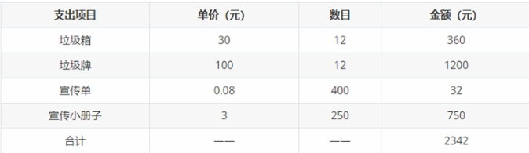
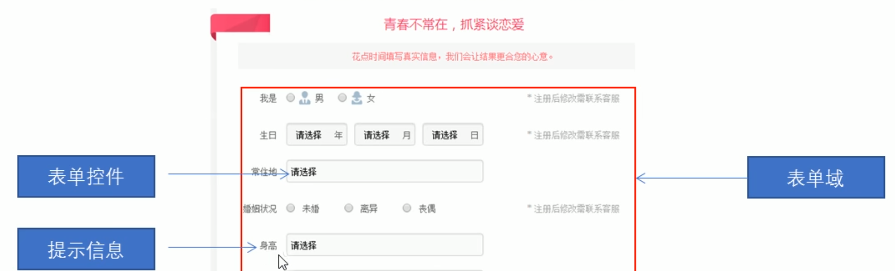

## 概述

### 网页

> **网站** 是指在 **因特网** 上根据一定的规则，使用 `HTML` 等制作的用于展示特定内容相关的 **网页集合**

> **网页** 是网站中的一 “页”，通常是 **`HTML` 格式的文件**，它需要通过 **浏览器** 来阅读

> 网页是构成网站的基本元素，它通常由图片、链接、文字、声音、视频等 **元素** 组成。通常看到的网页都是以 `.htm` 或 `.html` 后缀结尾的文件，因此将其俗称为 **HTML 文件**

---

### HTML

> **HTML** 指的是 **超文本标记语言(Hyper Text Markup Language)**，它是用来 **描述** 网页的一种语言

> HTML 不是一种编程语言，而是一种 **标记语言(Markup Language)**，标记语言是一套 **标记标签(Markup Tag)**

#### 超文本

1. **HTML** 中可以放入图片、声音、动画、多媒体等内容(超越了文本限制)

2. **HTML** 可以从一个文件 **跳转** 到另一个文件，与世界各地主机的文件连接(超级链接文件)

---

### 网页的形成

> 网页是由 **网页元素** 组成的，这些元素是利用 **`html` 标签** 描述出来，然后通过浏览器解析来显示给用户的

## 浏览器

### 常用浏览器

> 浏览器是网页显示、运行的平台。常用的浏览器有 **IE、火狐(Firefox)、谷歌(Chrome)、Safari、Opera** 等

### 浏览器内核

> 浏览器内核(渲染引擎)：负责读取网页内容、整理讯息、计算网页的显示方式并显示网页

|浏览器|内核|备注|
|-|-|-|
|IE|Trident|IE、猎豹安全、360急速浏览器、百度浏览器|
|Firefox|Gecko|火狐浏览器内核|
|Safari|Webkit|苹果浏览器内核|
|Chrome/Opera|Blink|Chrome/Opera浏览器内核，Blink 其实是 Webkit 的分支|

## Web 标准

> **Web 标准** 是由 W3C 组织和其他标准化组织所制定的 **一系列标准的集合**。W3C(万维网联盟) 是国际最著名的标准化组织

### 为什么需要 Web 标准

> 浏览器不同，同一个 **HTML 文件** 显示页面或者排版就有 **些许差异**。如果制定一个 **标准**，让 **主流的浏览器** 都来遵循这个标准，而开发人员在编写 **HTML 文件** 时也根据这个 **标准** 来进行网页开发，就可以实现即使浏览器不同但显示的效果也一致的 **目的**，那么这个 **标准** 就是 **Web 标准**


---

### 遵循 Web 标准的优点

> 遵循 Web 标准除了可以让不同的开发人员写出的页面更标准、更统一外，还有以下优点

1. 让 Web 的发展前景更广阔

2. 内容能被更广泛的设备访问

3. 更容易被搜索引擎搜索

4. 降低网站流量费用

5. 使网站更易于维护

6. 提高网页浏览速度

---

### Web 标准的构成

> Web 标准主要包括 **结构(Structure)、表现(Presentation)、行为(Behavior)** 三个方面

|标准|说明|
|-|-|
|结构|结构用于对 **网页元素** 进行 **整理和分类**，主要指的是 `HTML`|
|表现|表现用于设置 **网页元素** 的版式、颜色、大小等 **外观样式**，主要指的是 `CSS`|
|行为|行为用于定义 **网页模型** 和编写 **交互**，主要指的是 `Javascript`|

Web 标准提出的最佳体验方案：结构、表现、行为 **相分离**

简单理解：结构写到 `HTML` 文件中，表现写到 `CSS` 文件中，行为写到 `Javascript` 文件中

## HTML 标签

### HTML 语法规范

#### 基本语法

1. HTML 标签是指 被 **尖括号(<>)** 包围的 **关键词**，例如 `<html>`

2. HTML 标签通常是 **成对出现的(标签对)**，例如 `<html>` 和 `</html>`，称之为 **双标签**。**标签对** 中的 **第一个** 标签是 **开始标签**，**第二个** 标签是 **结束标签**

3. 有些特殊的标签 **必须** 是 **单个标签(极少情况)**，例如 `<br />` ，称之为 **单标签**

#### 标签关系

> 双标签关系可以分为两类：**包含** 关系和 **并列** 关系

1. 包含关系(父子)：一个标签里面 **嵌套** 另一个标签

```html
<head>
    <title> </title>
</head>
```

2. 并列关系(兄弟)：两个标签并列排布

```html
<head></head>
<body></body>
```

---

### HTML 基本结构标签

> 每个网页都会有一个基本的 **结构标签(也称为骨架标签)**，页面内容都是在这些基本标签上书写

> HTML 页面也称为 **HTML 文档**

|标签名|定义|说明|
|-|-|-|
|`<html></html>`|HTML 标签|页面中 **最大** 的标签，称之为 **根标签**|
|`<head></head>`|文档的 **头部**|注意：在 `head` 标签中 **必须** 要设置的是标签是 `title`|
|`<title></title>`|文档的 **标题**|让页面拥有一个属于自己的 **网页标题**|
|`<body></body>`|文档的 **主体**|包含文档的所有 **内容**，**页面内容** 基本都是放到 `body` 里面的|

```html
<html>
    <head>
        <title>First Page</title>
    </head>
    <body>
        槟榔加烟，法力无边！
    </body>
</html>
```

HTML 文档的后缀名 **必须** 是 `.html` 或 `.htm`，浏览器的作用是读取 HTML 文档，并以网页的形式显示出它们

#### <!DOCTYPE> 标签

> `<!DOCTYPE>`：**文档类型** 标签，作用就是告诉浏览器使用哪种 **HTML 版本** 来显示网页

1. `<!DOCTYPE>` 声明位于文档中的最 **前面** 的位置，处于 `html` 标签之前

2. `<!DOCTYPE>` 不是一个 HTML 标签，它就只是 **文档类型声明标签**

```html
<!-- 这句代码的意思是：当前页面采取的是 HTML5 版本来显示网页 -->
<!DOCTYPE html>
```

#### lang 属性

> 用来定义当前文档的 **显示语言**

1. `en` 定义语言为 **英文**

2. `zh-CN` 定于语言为 **中文**

```html
<!-- 当前这个网页是 英文网页 -->
<html lang=en>

</html>
```

简单来说，定义为 `en` 就是英文网页，定义为 `zh-CN` 就是中文网页

其实对于文档显示来说，定义成 `en` 的文档也可以显示中文，定义成 `zh-CN` 的文档也可以显示英文

这个属性乍一看没什么用，但是对浏览器和 **搜索引擎** 还是有作用的，比如定义为 `en` 时，浏览器会检测到这是个英文网页，会提示是否要将当前网页 **翻译** 成其它的语言显示(例如中文、日文...)

#### charset 属性

> 字符集(character set) 是多个字符的集合。以便计算机能够识别和存储各种文字

> 在 `head` 标签内，可以通过 `<meta>` 标签的 `charset` 属性来规定 HTML 文档使用哪种字符编码

```html
<head>
    <meta charset="UTF-8">
</head>
```

`charset` 常用的值有：`GB2312`、`BIG5`、`GBK`、`UTF-8`，其中 `UTF-8` 也被称为 **万国码**，基本包含了全世界所有国家需要用到的字符

---

### HTML 常用标签

#### 标题标签 h1-h6

> 为了使网页更具有语义化，会经常在页面中用到 **标题标签**。HTML 提供了 6 个等级的标题标签，即 `<h1>` - `<h6>`

```html
<h1>这是一级标题</h1>
<h2>这是二级标题</h2>
<h3>这是三级标题</h3>
<h4>这是四级标题</h4>
<h5>这是五级标题</h5>
<h6>这是六级标题</h6>
```

1. 标签语义：作为标题使用，并且根据重要性递减(标题号越小，标题越重要)

2. 特点：
   1. 加了标题的文字会 **变粗变大**
   2. 每个标题都 **独占一行**

#### 段落标签 p

> 在网页中，要把文字有条理地显示出来，就需要将这些文字 **分段显示**。在 HTML 标签中，`<p>` 标签用于 **定义段落**，它可以把整个网页分为若干个段落

```html
<p> 这是一个段落 </p>
```

1. 标签语义：可以把 HTML 文档分割为若干个 **段落**

2. 特点：
   1. 文本在一个段落中会根据浏览器窗口的大小自动换行
   2. 段落和段落之间保有空隙

#### 换行标签 br

> 在 HTML 中，一个段落中的文字会从左到右依次排列，直到浏览器的右端，然后才自动换行。如果希望某段文本 **强制换行** 显示，就需要使用 **换行标签 <br />**

```html
<br />
```

1. 标签语义：强制换行

2. 特点：
   1. `<br />` 是个 **单标签**
   2. `<br />` 只是简单的开始新的一行，跟段落不一样，段落之间会插入一些 **垂直** 的间距

#### 文本格式化标签

> 在网页中，有时需要为文字设置 **粗体**、*斜体*、或 <ins>下划线</ins>，这时就需要用到 HTML 中的文本格式化标签，使文字以特殊的方式显示

|语义|标签|说明|
|-|-|-|
|加粗|`<strong></strong>` 或者 `<b></b>`|更推荐使用 `strong>` 标签加粗 语义更强烈|
|倾斜|`<em></em>` 或者 `<i></i>`|更推荐使用 `em>` 标签倾斜 语义更强烈|
|删除线|`<del></del>` 或者 `<s></s>`|更推荐使用 `del>` 标签删除线 语义更强烈|
|下划线|`<ins></ins>` 或者 `<u></u>`|更推荐使用 `ins>` 标签下划线 语义更强烈|

标签语义：突出重要性，比普通文字更重要

#### div 和 span 标签

> `<div>` 和 `span` 是没有语义的，它们就是一个 **盒子**，用来装内容的

```html
<div>首页</div>
<div>新闻</div>
<span>百度</span>
<span>新浪</span>
```

1. `<div>` 标签用来布局，但是一行上只能放 **一个** `<div>`。大盒子

2. `<span>` 标签用来布局，一行上可以放 **多个** `<span>`。小盒子

#### 图像标签 img

> 在 HTML 中，`` 标签用于定义页面中的 **图像**

```html

```

1. `src` 是 `` 标签的 **必须属性**，它用用于指定图像文件的 **路径和文件名**

2. `` 标签的其它属性

    |属性|属性值|说明|
    |-|-|-|
    |`src`|图片路径|必须属性|
    |`alt`|文本|替换文本。图像不能显示时，代替图像显示的文本|
    |`title`|文本|提示文本。鼠标放到图像上，显示的文字|
    |`width`|像素|设置图像的宽度|
    |`height`|像素|设置图像的高度|
    |`border`|像素|设置图像的边框粗细|

注意：在设置 `` 的 `width` 或者 `height`，一般只设置其中一个的值，这样图片会 **等比例** 的自动缩放

#### 路径

1. 相对路径：以 **待引入文件(图片)** 的文件(HTML)为参考基础，而建立出的文件路径

    |相对路径分类|符号|说明|
    |-|-|-|
    |同一级路径||图像文件位于 HTML 文件同一级 如：``|
    |下一级路径|`/`|图像文件位于 HTML 文件下一级 如：``|
    |上一级路径|`../`|图像文件位于 HTML 文件上一级 如：``|

2. 绝对路径：是指目录下的 **绝对位置**，直接到达目标位置，通常是从 **盘符** 开始。例如：`D:\web\img\logo,png` 或者完整的网络地址：`http://www.bilibili.com/images/logo.png`

#### 超链接标签 a

> 在 HTML 标签中，`<a>` 标签用于定义 **超链接**，作用是从一个页面 **跳转** 到另一个页面

1. 链接的语法格式

    ```html
    <a href="跳转目标" target="目标窗口的弹出方式> 文本或图片 </a>
    ```

    |属性|作用|
    |-|-|
    |`href`|用于指定链接目标的 `url` 地址，当为标签设置 `href` 属性时，它就具有了超链接的功能|
    |`target`|用于指定链接页面的 **打开方式**，其中 `_self` 为默认值，表示在 **当前页面** 打开链接；`_blank` 会在浏览器中 **新开一个页面**，并在这个新开的页面中打开链接|

2. 链接分类

    - 外部链接，例如：`<a href="https://www.baidu.com" target="_blank"> 百度 </a>`
    - 内部链接：网站内部页面之间的相互链接，直接链接内部 **页面名称** 即可。例如 `<a href="index.html"> 首页 </a>`
    - 空链接：如果当时没有确定链接目标时，可以设置为 **空链接**。例如：`<a href="#"> 空链接 </a>`
    - 下载链接：如果 `href` 里面的地址是一个 **文件(.exe)** 或 **压缩包(.zip)**，那么点击这个超链接就会下载这个文件。例如：`<a href="">下载</a>`
    - 网页元素链接：在网页中的各种网页元素，如文本、图像、表格、音频、视频等都可以添加超链接
    - 锚点链接：点击链接，可以快速定位到页面中的某个位置
      - 在链接文本的 `href` 属性中，设置属性值为 `#名字` 的形式，如：`<a href="#two"> 第二季 </a>`
      - 找到目标位置标签，里面添加一个 `id` 属性 = 上面的名字，如：`<h3 id="two"> 第二季详细介绍... </h3>`

#### 注释标签

> 如果需要在 HTML 文档中添加一些便于阅读和理解但又不需要显示在页面中的注释文字。就需要使用 **注释标签**

> HTML 中的注释以 `<!--` 开头，以 `-->` 结束

```html
<!-- 注释语句 -->
```

添加注释是为了更好地解释代码的功能，便于开发人员理解和阅读代码，程序是不会执行注释内容的

#### 特殊字符

> 在 HTML 页面中，一些特殊的符号(空格...)很难或者不方便直接使用，此时可以使用一些 **字符** 来替代

|特殊字符|描述|字符的代码|
|-|-|-|
|` `|空格符|`&nbsp;`|
|`<`|小于号|`&lt;`|
|`>`|大于号|`&gt;`|
|`&`|和号|`&amp;`|
|`￥`|人民币|`&yen;`|
|`©`|版权|`&copy;`|
|`®`|注册商标|`&reg;`|
|`°`|摄氏度|`&deg;`|
|`±`|正负号|`&plusmn;`|
|`×`|乘号|`&times;`|
|`÷`|除号|`&divide;`|
|`²`|平方2|`&sup2;`|
|`³`|立方3|`&sup3;`|

---

### 表格标签

> 表格主要用于 **显示、展示数据**，因为它可以让数据显示得非常的规整。特别是后台展示数据的时候，一个清爽简约的表格能够把繁杂的数据表现得很有条理



```html
<table>
    <tr>
        <td>单元格内的文字</td>
        ...
    </tr>
    ...
</table>
```

1. `<table>` 是用于定义表格的标签

2. `<tr>` 标签用于定义表格中的 **行**，必须 **嵌套** 在 `<table></table>` 标签中

3. `<td>` 标签用于定义表格中的 **单元格**，必须 **嵌套** 在 `<tr></tr>` 标签中

#### 表头单元格标签

> 一般 **表头单元格** 位于表格的第一行或第一列，表头单元格里面的文本内容加粗居中显示

> `<th>` 标签表示 HTML 表格的 **表头** 部分(table head 的缩写)

```html
<table>
    <tr>
        <th>表头</th>
    </tr>
</table>
```

#### 表格属性

|属性名|属性值|描述|
|-|-|-|
|`align`|`left`、`center`、`right`|规定表格相对周围元素的对齐方式|
|`border`|`1` 或 `""`|规定表格单元是否拥有边框，默认为 `""`，表示没有边框|
|`cellpadding`|像素值|规定单元边沿与其内容之间的空白，默认 1 像素|
|`cellspacing`|像素值|规定单元格之间的空白，默认 2 像素|
|`width`|像素值或百分比|规定表格的宽度|
|`height`|像素值或百分比|规定表格的高度|

注意：这些属性要写到 `<table>` 标签中

#### 表格结构标签

> 在表格标签中，分别用：`thead` 标签表示表格的 **头部** 区域，`<tbody>` 标签表示表格的 **主体** 区域。这样可以更好的分清表格结构

1. `<thead></thead>`：用于定义表格的 **头部**。`<thead>` 内部必须拥有 `<tr>` 标签。

2. `<tbody></tbody>`：用于定义表格的 **主体**，主要用于房数据本体

3. 以上两个标签都是放在 `<table>` 标签中

#### 合并单元格

> 特殊情况下，可以把多个单元格并为一个单元格

- 合并单元格方式：
  - 跨行合并：`rowspan = "合并单元格的个数"`
  - 跨列合并：`colspan = "合并单元格的个数"`

- 目标单元格(写合并代码的地方)：
  - 跨行：最 **上测** 单元格为目标单元格，写合并代码
  - 跨列：最 **左侧** 单元格为目标单元格，写合并代码

- 合并单元格三部曲
  - 先确定是跨行还是跨列合并
  - 找到目标单元格，写上 `合并方式 = 合并的单元格数量`。例如：`<td colspan="2"></td>`
  - 删除多余的单元格

注意：不管是跨行还是跨列，合并代码都是要写在目标 **单元格(即写在 `<th>` 上)** 上的

---

### 列表标签

> 列表是用来 **布局** 的，列表最大的特点就是整齐、整洁、有序，它作为布局会更加自由和方便

> 根据使用情景不同，列表可以分为三大类：**无序列表**、**有序列表**、**自定义列表**

#### 无序列表

> `<ul>` 标签表示 HTML 页面中项目的无序列表，一般会以 **项目符号** 呈现列表项，而列表项使用 `<li>` 标签定义

```html
<ul>
    <li>列表项1</li>
    <li>列表项2</li>
    <li>列表项3</li>
    ...
</ul>
```

1. 无序列表的各个列表之间没有顺序级别之分，是并列的

2. `<ul></ul>` 中只能嵌套 `<li></li>`，直接在 `<ul></ul>` 标签中输入其它标签或者文字的做法是 **不被允许** 的

3. `<li>` 与 `</li>` 之间相当于一个 **容器**，可以容纳所有元素

4. 无序列表会带有自己的样式属性，但在实际使用时会使用 `CSS` 来设置

#### 有序列表

> 有序列表即为有排列顺序的列表，其各个列表会按照一定的顺序排列定义

> 在 HTML 标签中，`<ol>` 标签用于定义有序列表，列表的排序以数字来显示，并且使用 `<li>` 标签来定义列表项

```html
<ol>
    <li>列表项1</li>
    <li>列表项2</li>
    <li>列表项3</li>
</ol>
```

1. `<ol></ol>` 中只能嵌套 `<li></li>`，直接在 `<ol></ol>` 标签中输入标签或者文字时不被允许的

2. `<li>` 与 `</li>` 之间相当于一个 **容器**，可以容纳所有元素

3. 有序列表会带有自己的样式属性，但在实际使用时会使用 `CSS` 来设置

#### 自定义列表

> 自定义列表常用于对术语或名词进行解释和描述，定义列表的列表项前没有任何符号项目

> 在 HTML 标签中，`<dl>` 标签用于定义描述列表(或定义列表)，该标签会与 `<dt>` (定义项目/名字) 和 `<dd>` (描述每个项目/名字) 一起使用

```html
<dl>
    <dt>名词</dt>
    <dd>名词解释1</dd>
    <dd>名词解释2</dd>
</dl>
```

1. `<dl></dl>` 里面只能包含 `<dt>` 和 `<dd>`

2. `<dt>` 和 `<dd>` 没有个数限制，经常是一个 `<dt>` 对应多个 `<dd>`

3. `<dt>`/`<dd>` 与 `</dt>`/`</dd>` 之间相当于一个 **容器**，可以容纳所有元素

---

### 表单标签

#### 为什么需要表单

1. 使用表单的目的是为了 **收集用户信息**

2. 在网页中，需要跟用户进行交互，收集用户资料，此时就需要表单

#### 表单的组成

> 在 HTML 中，一个完整的表单通常由 **表单域**、**表单控件(也称为表单元素)**、**提示信息** 3 个部分构成



##### 1、表单域

> 表单域是一个 **包含表单元素** 的区域

> 在 HTML 标签中，`<form>` 标签 用于定义表单域，以实现用户信息的收集和传递

> `<form>` 会把它范围内的表单元素信息提交给 **服务器**

```html
<form action="url地址" method="提交方式" name="表单域名称">
    各种表单元素控件
</form>
```

|属性|属性值|作用|
|-|-|-|
|`action`|url地址|用于指定接收并处理表单数据的服务器程序的 **url地址**|
|`method`|get/post|用于设置表单数据的 **提交方式**|
|`name`|名称|用于指定 **表单的名称**，以区分同一个页面中的多个表单域|

1. 在写表单元素之前，应该有个 **表单域** 把它们进行包含

2. 表单域就是 `<form>` 标签

##### 2、表单控件(表单元素)

> 在表单域中可以定义各种表单元素，这些表单元素就是允许用户在表单中 **输入** 或者 **选择** 的内容控件

1. `input` 是输入的意思，在表单元素中，`<input>` 标签用于 **收集** 用户信息
   
   - 在 `<input>` 标签中，包含一个 `type` 属性，根据不同的 `type` 属性值，输入字段拥有很多种形式(可以是文本字段、复选框、文本控件、单选按钮、按钮等)

    ```html
    <input type="属性值" />
    ```

    - `<input />` 标签为 **单标签**
  
    - `type` 属性设置不同的属性值用来指定不同的控件类型

        |属性值|描述|
        |-|-|
        |`button`|定义可点击 **按钮** (多数情况下，用于通过 `Javascript` 启动脚本)|
        |`checkbox`|定义 **复选框**|
        |`file`|定义 **输入字段**和 **“浏览”按钮**，供文件上传|
        |`hidden`|定义 **隐藏** 的输入字段|
        |`image`|定义图像形式的 **提交按钮**|
        |`password`|定义 **密码** 字段，该字段中的字符被掩码|
        |`radio`|定义 **单选按钮**|
        |`reset`|定义 **重置按钮**，重置会清楚表单中的所有数据|
        |`submit`|定义 **提交按钮**，提交按钮会把表单数据发送到服务器|
        |`text`|定义 **单行** 的输入字段，用户可在其中输入文本。默认宽度为 20 个字符|

    - 除 `type` 属性外，`<input>` 标签还有其它常用属性

        |属性|属性值|描述|
        |-|-|-|
        |`name`|由用户自定义|定义 `input` 标签的名称|
        |`value`|由用户自定义|规定 `input` 元素的值|
        |`checked`|checked|规定此 `input` 元素 **首次加载** 时应当 **被选中**|
        |`maxlength`|正数值|规定输入字段中的字符的 **最大长度**|

        - `name` 和 `value` 是每个表单元素都有的属性值，主要给后台人员使用。当在表单域中点击 `submit` 提交按钮时，会把每个表单元素的 `name` 和 `value` 作为 **键值对** 发送给后台，若表单元素没有定义 `name` 属性，那么该表单元素的数据将 **不能被收集并发送给后台**
        - `name` 表示表单元素的 **名字**，要求 **单选按钮** 和 **复选框** 的多个 `<input>` 中要有相同的 `name` 值
        - `checked` 属性主要针对于 **单选按钮** 和 **复选框**，主要作用是一打开页面，就可以 **默认选中** 某个表单元素(`checked` 是属性名，想要被默认选中的表单元素的 **属性值** 也为 `checked`)
        - `maxlength` 表示用户可以在表单元素中输入的 **最大字符数**

2. `<label>` 标签为 `<input>` 元素定义 **标注**
   
   - `<label>` 标签用于 **绑定** 一个表单元素(比如绑定 `<input>`)，当点击 `<label>` 标签内的 **文本** 时，浏览器就会自动将 **焦点(光标)** 转到或者选择对应的 **表单元素** 上，用来增加用户体验

        ```html
        <label for="sex">男</label>
        <input type="radio" name="sex" id="sex">
        ```

        核心：`<label>` 标签的 `for` 属性应当与相关 **表单元素** 的 `id` 属性 **相同**

3. 在页面中，如果有多个选项让用户选择，并且想要节约页面空间时，可以使用 `<select>` 标签控件定义 **下拉列表**

    ```html
    <select>
        <option>选项1</option>
        <option>选项2</option>
        <option>选项3</option>
    </select>
    ```

    - `<select>` 中至少包含一对 `<option>`
    - 在 `<option>` 中定义 `selected = "selected"` 时，当前项即为 **默认选中项**
    - `<select>` 标签属性
      - `name`：同所有其它表单元素一样，下拉列表要想被正确 **提交**，需要设置 `name` 属性，用于定义当下拉列表在提交时，发送给服务器的 **键**
    - `<option>` 标签属性
      - `value`：用来定义当下拉列表在提交时，发送给服务器的 **值**

4. 当用户输入内容较多的情况下，就不能再使用文本框表单了，此时可以使用 `<textarea>` 标签

    - 在表单元素中，`<textarea>` 标签是用于定义多行文本输入的控件

        ```html
        <textarea rows="3" cols="20">
            文本内容
        </textarea>
        ```

      - 通过 `<textarea>` 标签可以轻松的创建 **多行** 文本输入框
      - `cols = 每行中的字符数`，`rows = 显示的行数`


